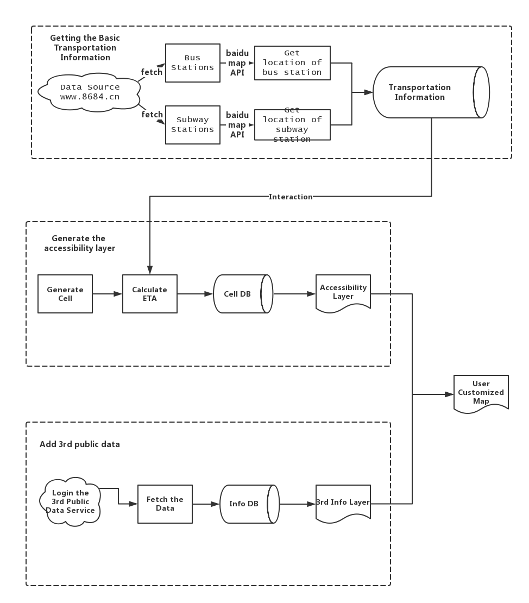

# Accessibility Heatmap over Residence

Showing the accessibility heatmap and candidate list.

## Author

[Chenglong Hu @sonnyhcl](github.com/sonnyhcl)

[Chen Xi @iamcxnoguigan](github.com/iamcxnoguigan)

[Teddy Mao @luvletter](github.com/luvletter)

## Empathize

- If you want to rent a house, where would you like to choose?
  - Of course, convenient transportation is critical.

## Define

- What do your users need?
  - People may want to know the transportation about, for example, know how long will take for start from his residence in Shanghai.

## Ideate

- Scenario
  - We are trying to divided the city into x by y cells. Using bus and metro line data to estimate time to spend from one to another, and trying to classify them as a block. 

- Possible solutions
  - Bus line and metro line information is accessible to public and can be fetch by [8684](http://www.8684.cn/). Full metadata is also accessible from [FourSquare API](https://developer.foursquare.com/places-api)

- Key involved stakeholders
  - 8864
  - Foursquare
  - OpenStreetMaps

- Key metrics for evaluating
  - The precision of the estimation of ETA and the candidate list.
  - The resolution of the heatmap.

- Similar or related scenarios
  - The place of interest recommendation on Airbnb

## Prototype

Prototype as a website.

## Test

Create the heatmap for every Shanghai University.

## Reference
- [life circle report by Amap](http://report.amap.com/mobile/life.do)
- [the vein of the city](https://www.96486d9b.xyz/City-Vein/html/shanghai.html)

## Missions
### section 1 : basic
1. find out the usage of AMAP, almost frontend -> cx
2. verify the usage of AMAP batch API -> hcl
3. design the iterate algorithms -> mct
### section 2 : 3rd party
1. swarm api: both frontend and backend
2. find poi using Meituan
### section 3 : more if possible
1. house price and renting price => to generate house heatmap
2. combine two heatmap
3. interact between two people who want to find place for specific purpose. Find the overlap of their transportation cycle and find the result in POI.

# Quality of Data
> Elaborate more!!!
## Possible Incidents
- It needs plenty of queries and of course a lot of time to query amap url for enough possible points getting real-time life cycles.

## Elasticity Rules
- Queries should be produced in batch or paralellly rather than serially.
    -   It can help reduce the burden of our servers.
- Results should be rendered asynchronously. Fetch one result and render one.
    -   It can make users feel much better in a simple way rather than adding more servers.

## QoD Metrics
- Q: **Domain-specific metrics**
    - Need specific tools and expertise for determining metrics
- A: We assume that life circle is continuous and uninterrupted. So if we wanna know the edge of 20 minutes life cycle, we can first search one point in one direction for 20 minutes distance, and then we have a rough 20 minutes radius. Then we search the ring around the 20 minutes circle. It can help us reduce query times a lot and better use batch query provided by amap.

-------------

- Q: **Evaluation**
    - Cannot done by software only: humans are required
    - Exact versus inexact evaluation due to big and streaming data
- A: There are some parameters that still need human to define which is better.

-------------

- Q: **Complex integration model**
    - Where to put QoD evaluators and why?
    - How evaluators obtain the data to be evaluated?
- A: QoD is both needed for the input data and output data. For us, our input is the data from amap api and our output data is the feedback of the users.

-------------

- Q: **Impact of QoD evaluation on performance of data analytics workflows**
- A: It can help us reduce a lot when querying using amap api. However, it need much more human attention.

## Tool
- [Telegraf](http://www.telegraf.rs/) 
    - store the input evaluation, output and user feedback.

## Where We Use

#### Data Frame
* The 
<!-- ew -->

#### 3rd Service Provider
* Design of APIs: parameters, quantity, output items
* The update frequency and quality
* The review score from the provider, like the comment in OpenStreetMaps

#### Output Data
* Calculate the precision by comparing output data with the real value
* Receive the user feedback and suggestion

# Framwork
